# Desafio Maker - Carro Robótico

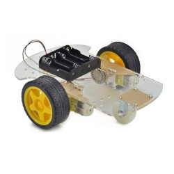

## Montagem de Carro Robótico

O Desafio Maker do Curso Arduino consiste em produzir um material com instruções de montagem de um carro robótico, ou seja, o participante precisa editar esse arquivo README.md adicionando instruções de montagem do seu projeto de carro robótico.

Para isso o participante precisa fazer um fork deste projeto e enviar um Pull Request ao final, veja mais detalhes no item de regras do desafio, mais abaixo.

## Regras do Desafio

- Todos podem participar, exceto funcionários do Curso Arduino (no caso, eu e minha família).
- Tem que ser pessoa física, mesmo que seja representando uma empresa, mas a premiação é para uma pessoa só.
- O ganhador será decidido por enquete, em Março, via divulgação no canal do [Curso Arduino do Youtube](http://www.youtube.com/cursoarduino) (plataforma de enquete a ser decidida ainda...)
- A enquete será composta dos projetos escolhidos, em Fevereiro, pela equipe do Curso Arduino, no máximo 5 candidatos, que terão seus projetos montados pelo Renato Aloi em vídeo e divulgados no canal do [Curso Arduino do Youtube](http://www.youtube.com/cursoarduino).
- O material utilizado deve ser exatamente os indicados na seção `Equipamentos` desse documento, podendo deixar algum material de lado, mas não utilizar um que não esteja listado (senão não vou conseguir reproduzir o tutorial).
- Os materiais adicionais que podem ser utilizados estão na seção `Equipamentos Adicionais`.
- O participante deve fazer um fork desse projeto e trabalhar no projeto copiado pelo fork; e ao final enviar um Pull Request com suas modificações nos arquivos.
- O participante deve desenvolver um material com instruções detalhadas, em forma de tutorial, que possam ser seguidas de forma sequencial e que o produto final seja um carro robótico que funcione.
- O material deve ser produzido a partir desse documento README.md e pode conter imagens adicionais, graficos, esquemas elétricos e tudo mais, desde que esteja na mesma pasta deste arquivo.
- O projeto deve contar com um esquema elétrico também.
- O projeto deve também possuir um código pra ser carregado no Arduino.
- Caso a montagem não funcione ao final depois de todas as etapas descritas concluídas o projeto será desclassificado.
- O tema é livre, sendo que pode ser um carro seguidor de linha, um carro de controle remoto, um carro que desvie de obstáculos, ou tudo isso ao mesmo tempo. Use sua criatividade, pois os projetos que funcionarem ainda serão avaliados para que seja escolhido um ganhador.
- Os participantes tem até o último dia de Janeiro de 2022 para enviarem seus projetos via Pull Request.
- Os projetos serão testados pela equipe do Curso Arduino e escolhidos para serem candidatos ao melhor projeto até o último dia de Fevereiro de 2022.
- Até o último dia de Março de 2022 o projeto vencedor será escolhido e ganhará o Kit apresentado no vídeo do link abaixo:
  - https://www.youtube.com/watch?v=lNO2uD6NzvE&t=3s

## Esquema Elétrico

O esquema elétrico deve indicar as ligações entre o Arduino e os componentes. Deve ser também o mais completo possível.

Alguns exemplos de esquema elétrico abaixo:

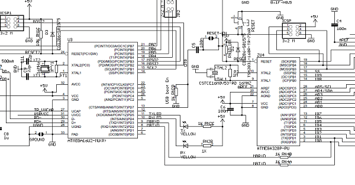

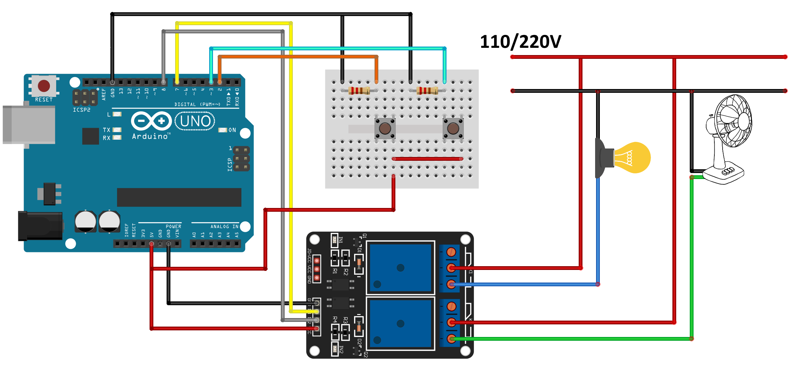

## Equipamentos

- Arduino UNO
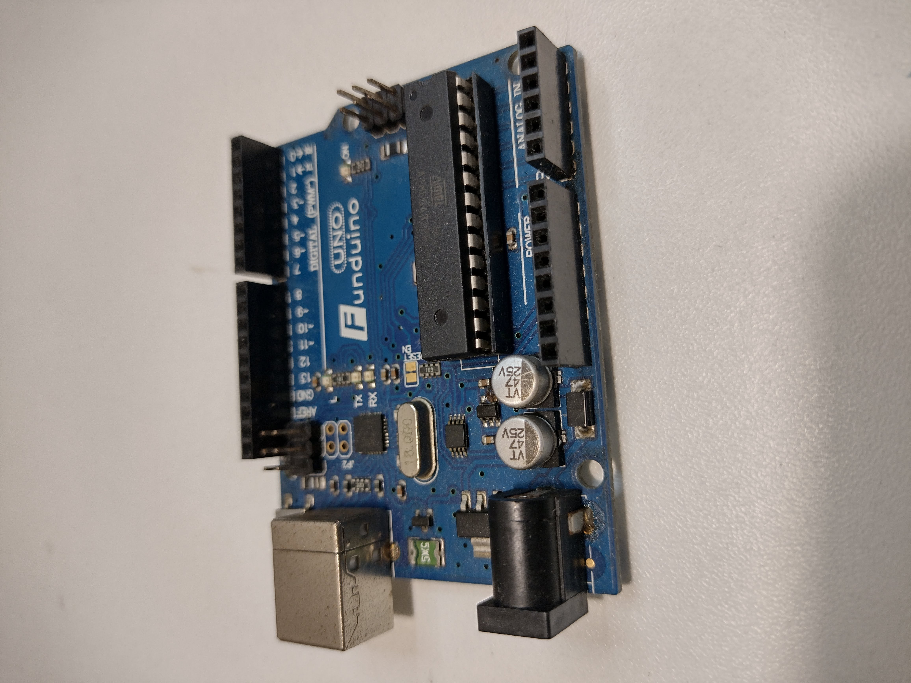
  - Documentação: https://www.circuito.io/blog/arduino-uno-pinout/
  - Datasheet: https://www.arduino.cc/en/uploads/Main/arduino-uno-schematic.pdf

- Shield SIGE Robótica
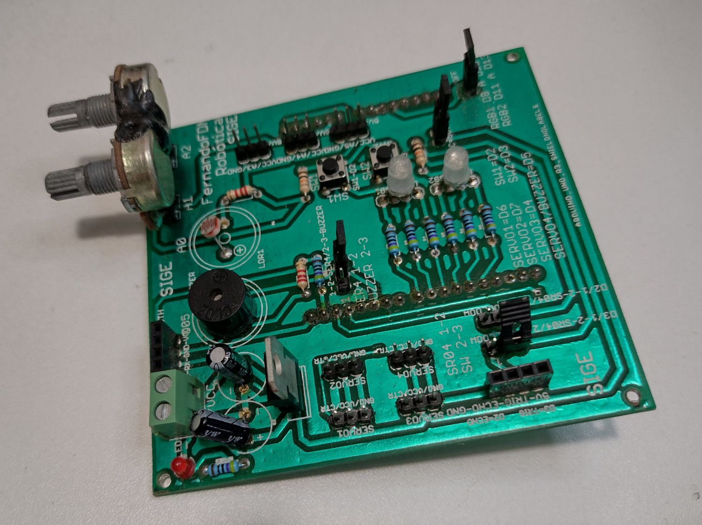
  - Datasheet: [Clique aqui para baixar o PDF](datasheet_sige_robotica.pdf)

- Plataforma Carro Robótico
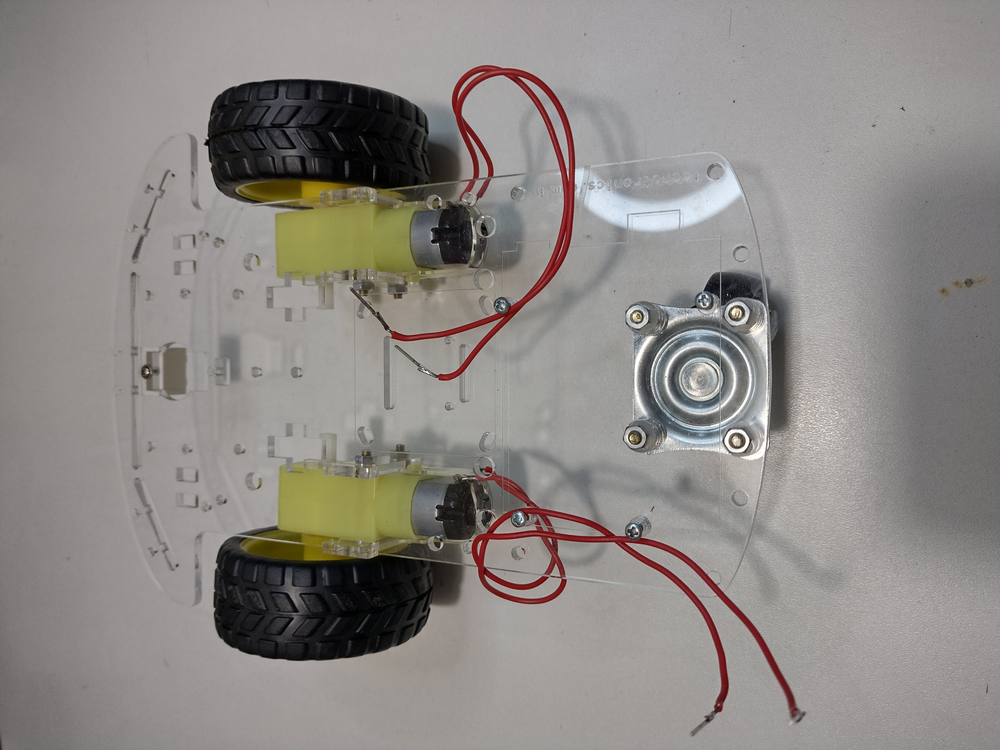
  - Descrição: Chassis robótico com 2 motores DC, caixas de redução, rodas e pneus.

- Bateria 7.2V com carregador
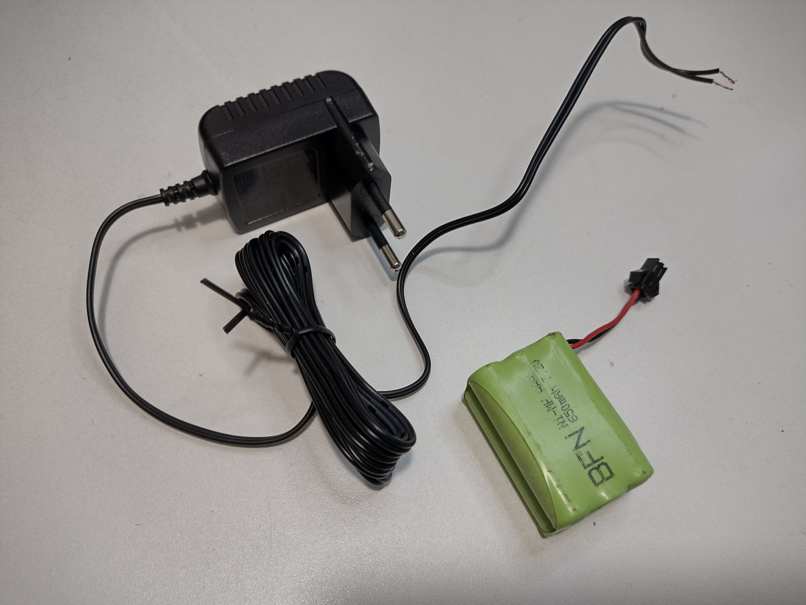
  - Descrição: Bateria 7,2V 650mAh

- Controle de Playstation 2
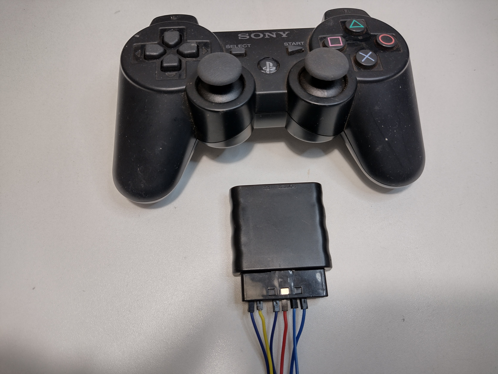
  - Descrição: Controle de videogame com receptor sem fio.
  - Documentação: [Clique aqui para ver a documentação](https://create.arduino.cc/projecthub/electropeak/how-to-interface-ps2-wireless-controller-w-arduino-a0a813)

- Motor Shield L293D - Driver Ponte H para Arduino
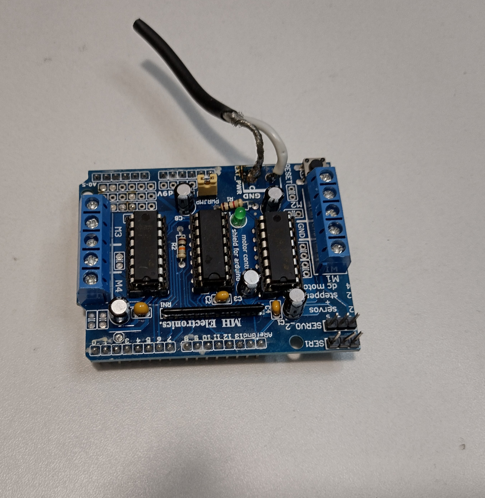
  - Datasheet: https://www.arduino.cc/documents/datasheets/L293D.pdf

- Sensor Ultrassônico
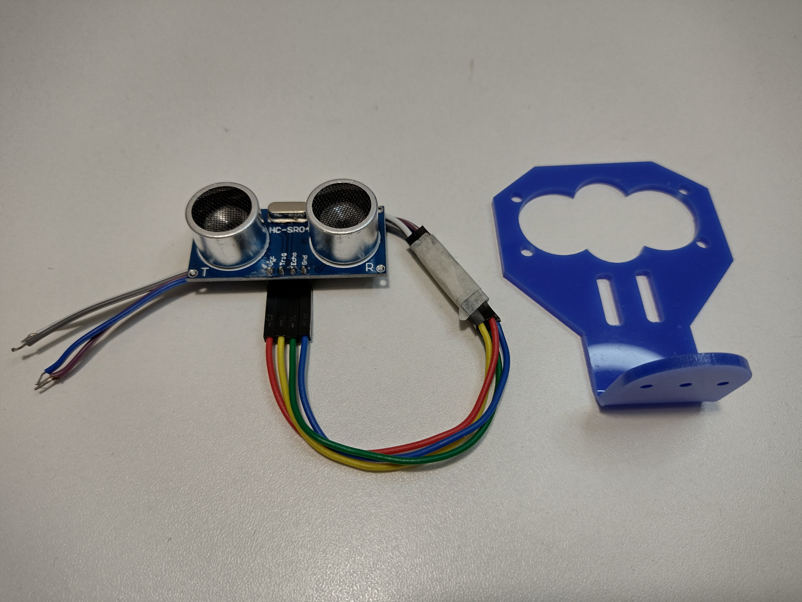
  - Datasheet: https://cdn.sparkfun.com/datasheets/Sensors/Proximity/HCSR04.pdf

- Sensor Seguidor de Linha
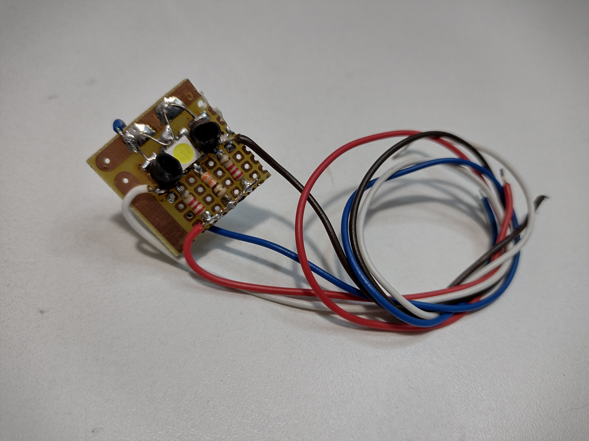
  - Descrição: Sensor seguidor de linha com LED de 3W. Fiação: Vermelho = 5V, Azul = GND, Branco = sinal sensor 1, Preto = sinal sensor 2

- Servo motor 9g
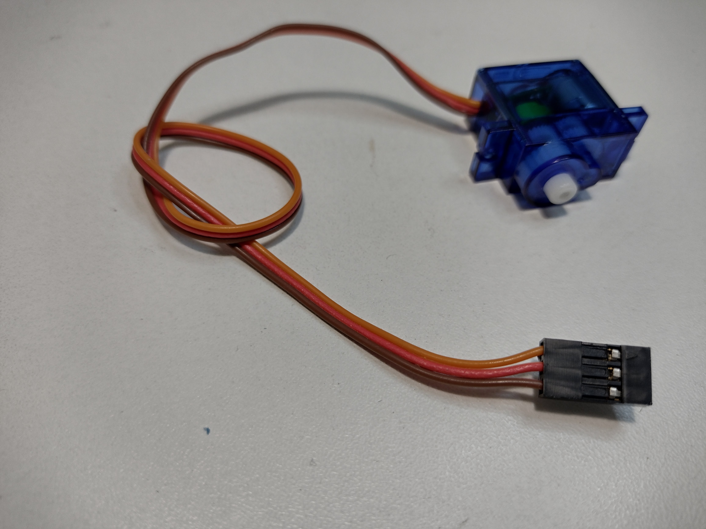
  - Descrição: Servo motor 9g.
  - Datasheet: http://www.ee.ic.ac.uk/pcheung/teaching/DE1_EE/stores/sg90_datasheet.pdf 

## Instruções de montagem

Inclua aqui as suas instruções de montagem que possam ser seguidas passo-a-passo, em sequência.

Utilize as próprias fotos dos equipamentos ou outras fotos, esquemas, gráficos, o que você achar necessário para entendimento dos passos.

## Código Arduino

O código do Arduino deve ser colocado abaixo entre as tags específicas de código do markdown.

> [Veja mais detalhes sobre tags de código clicando aqui.](https://www.markdownguide.org/extended-syntax/#:~:text=The%20basic%20Markdown%20syntax%20allows,and%20after%20the%20code%20block)

Exemplo de código abaixo:

```cpp
int led = 13;
void setup() {
 pinMode(led, OUTPUT);
}
void loop() {
 digitalWrite(led, HIGH);
 delay(1000);
 digitalWrite(led, LOW);
 delay(1000);
}
```

## Equipamentos Adicionais

Além dos equipamentos listados acima na seção de `Equipamentos`, os equipamentos adicionais abaixo podem ser também utilizados nas montagens e fotos adicionais.

Entre em contato pelo `Issues` caso precise adicionar algum componente adicional não listado abaixo:

- Resistores, Capacitores, e componentes discretos comuns
- Fios, jumpers, cabos
- Conectores padrão MODU compatível com Arduino
- Adaptadores de servo motor
- Headers de shields
- Espaçadores plásticos em 3D (formato do arquivo: STL, tamanho máximo: 10x10x10cm)
- Porcas, parafusos, arruelas


## Prêmiação do Desafio

### 1º Lugar

- Kit completo (e atualizado, pois todos os componentes que forem usados na montagem serão enviados junto com o kit)
  - > Envio sem custos (desde que seja no Brasil)
  - > Vide fotos abaixo
- Divulgação do tutorial de montagem no canal do Curso Arduino no Youtube
- Live com Renato Aloi no canal do Curso Arduino no Youtube para apresentar o projeto.

### 2º ao 5º Lugares

- Divulgação do tutorial de montagem no canal do Curso Arduino no Youtube.

Abaixo segue uma foto do prêmio oferecido pelo desafio. Quem ganhar o desafio leva o kit todo de peças que está dentro da caixa da foto abaixo! Participe, boa sorte!

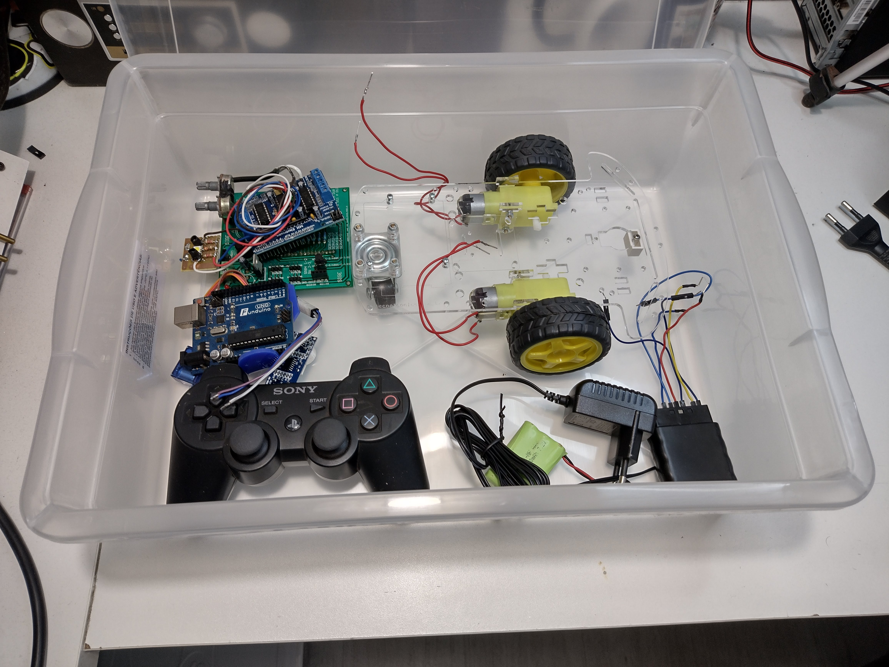
